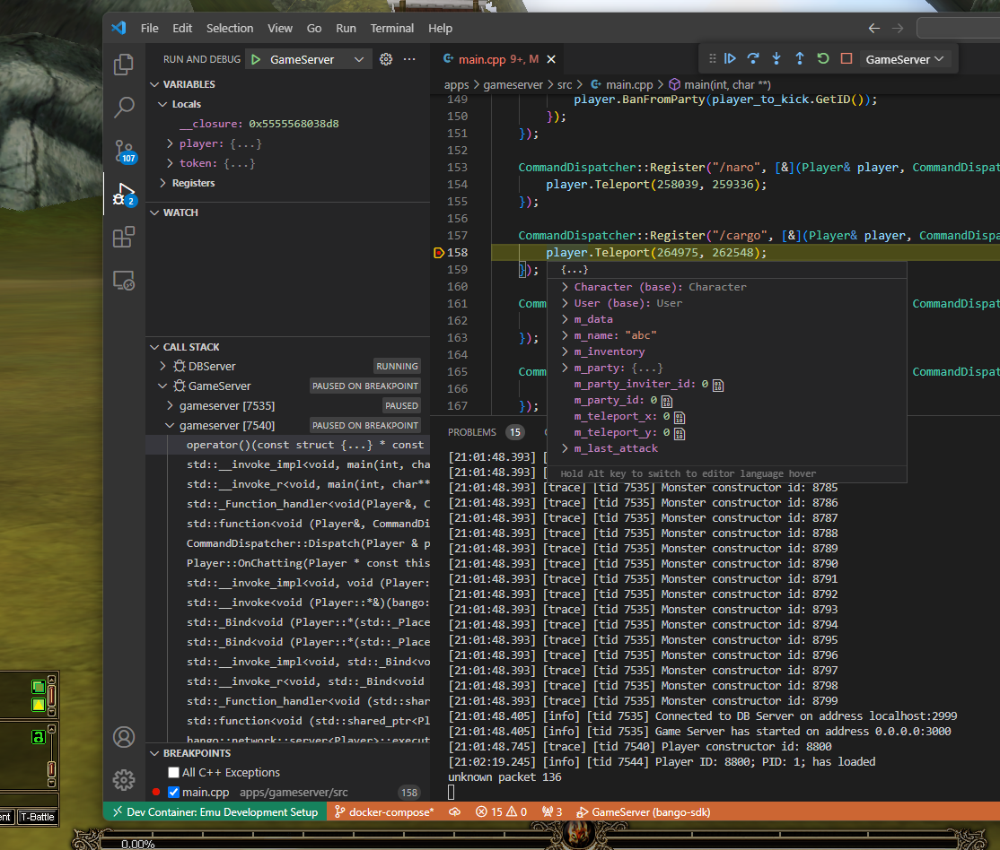
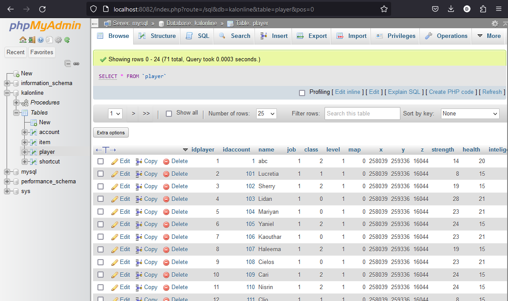

# Deployment using Docker

## Install Docker

https://www.docker.com/

## Install WSL2

Skip if deploying on linux.  
https://learn.microsoft.com/en-us/windows/wsl/install

## Provide server configs path

Create `.env` file in repo root directory and provide path to server configuration files:
```
CONFIG_PATH=C:\Path\To\Server\Configs
```

## Build the images

```
docker compose build
```

## Start services

```
docker compose up
```

# Dev environment via VS Code on Windows

Setup on Windows makes it easy to test the emu via Game Client which is available on Windows only.

There is ready to use `.devcontainer.json` [file](../.devcontainer/devcontainer.json) in `.devcontainer` directory.

Install [VSCode](https://code.visualstudio.com/).

Install _Dev Containers_ plugin: `
ms-vscode-remote.remote-containers`

`CTRL+SHIFT+P`

`> Reopen in Container`

This will re-open the directory inside docker container which is created out of `Dockerfile.ubuntu20`. It contains GDB and building tools required to build and debug DBServer and GameServer. It will expose port 3000 to the host, so if you start the server inside the container on port 3000, you can connect to it using client on Windows host.

It will also setup MySQL 8 container and PHPMyAdmin so you can debug data persistence issues via web app. http://localhost:8082

After reopened:

`CTRL+SHIFT+P`

`> Run Task`  
`Run CMake`

`> Run Task`  
`Build`

This will build DBServer and GameServer with debug flags.

After build is completed:

`CTRL+SHIFT+P`

`> Debug: Select and Start Debugging`  
`DBServer`

`> Debug: Select and Start Debugging`  
`GameServer`

To start both - DB and Game server. You are not ready to login from client on Windows and put breakpoints to the server code using debugger.

## Put your first breakpoint



## View database data

Visit http://localhost:8082
```
ID: root
Pass: password
```


